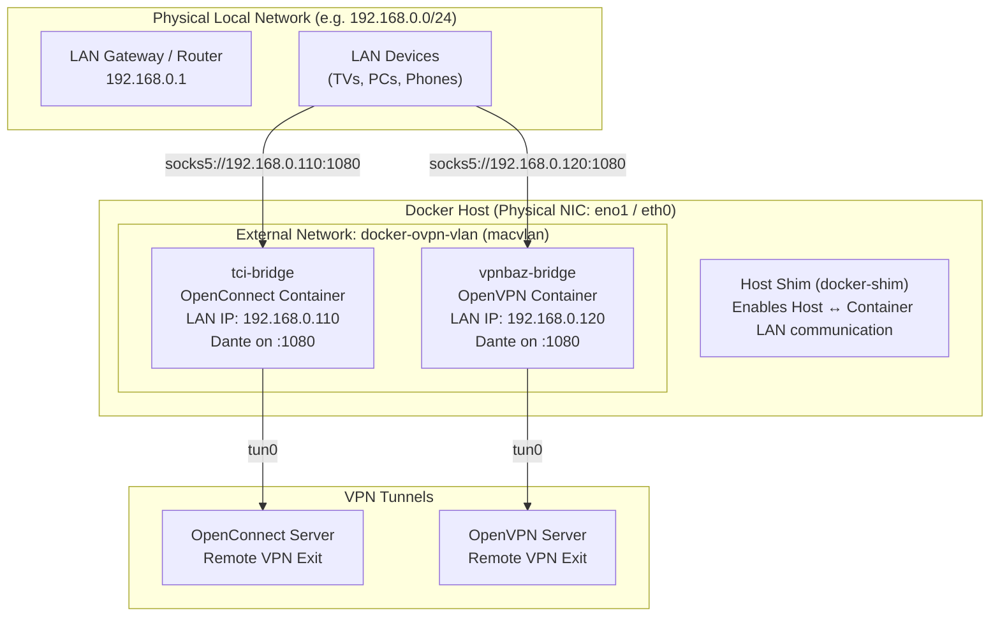

# Docker Macvlan & Bridge Networking Guide

This guide explains how to deploy VPN containers with direct local area network (LAN) IP addresses using Docker's **macvlan** driver alongside an internal Docker bridge.

---

## 1. Overview & Architecture

By default, Docker containers share the host's IP and require port mappings. With the **macvlan** network driver, each VPN container is assigned its own dedicated, routable MAC and IPv4 address directly on your physical local network (e.g., `192.168.0.110` and `192.168.0.120`).

### Why use Macvlan?
- **Direct LAN Access**: Any device on your local network (smart TVs, media players, phones, other servers) can access the SOCKS5 proxy using standard `IP:Port` endpoints (e.g. `192.168.0.110:1080`) without requiring port forwarding on the Docker host.
- **Port Conflict Elimination**: Multiple containers can bind to default ports (e.g. port `1080`) on different LAN IP addresses.
- **Embedded Dante Proxy**: Each container runs its own Dante SOCKS5 proxy bound to `tun0`. Incoming requests received on the container's macvlan IP exit through that container's specific VPN tunnel.

### Network Architecture Diagram



---

## 2. Step-by-Step Setup

### Step 1: Identify Host Network Interface & Subnet

Find your host's physical network interface name and current subnet:

```bash
# Locate active physical interface (e.g., eth0, eno1, enp3s0)
ip -4 route show default
```

*Example output:*
```text
default via 192.168.0.1 dev eno1 proto dhcp src 192.168.0.50 metric 100
```
In this example:
- **Parent Interface**: `eno1`
- **Subnet**: `192.168.0.0/24`
- **Gateway**: `192.168.0.1`

### Step 2: Create the Shared External Macvlan Network

Create the `docker-ovpn-vlan` network before starting containers. Reserve an IP range (e.g., `192.168.0.100/27`, providing IPs `192.168.0.96`–`192.168.0.127`) that does not overlap with your router's DHCP pool:

```bash
docker network create \
  --driver macvlan \
  -o parent=eno1 \
  --subnet=192.168.0.0/24 \
  --gateway=192.168.0.1 \
  --ip-range=192.168.0.100/27 \
  docker-ovpn-vlan
```

Verify network creation:

```bash
docker network inspect docker-ovpn-vlan --format '{{json .IPAM.Config}}'
```

### Step 3: Configure `docker-compose.bridge.yml`

Assign static IP addresses from your reserved macvlan range to each container:

```yaml
services:
  vpnbaz-bridge:
    extends:
      file: docker-compose.base.yml
      service: ovpn-template
    container_name: vpnbaz-bridge
    networks:
      ovpn-bridge: {}
      docker-ovpn-vlan:
        ipv4_address: 192.168.0.120
    environment:
      - PROXY_PORT=1080
      - VPN_CONFIG=/etc/openvpn/nl1-typ2.ovpn
    volumes:
      - ./configs/ovpn-vpnbaz:/etc/openvpn:ro,z

  tci-bridge:
    extends:
      file: docker-compose.base.yml
      service: openconnect-template
    container_name: tci-bridge
    networks:
      ovpn-bridge: {}
      docker-ovpn-vlan:
        ipv4_address: 192.168.0.110
    environment:
      - PROXY_PORT=1080
      - VPN_SERVER=mcipower1.apibaz.org
    ports:
      - "9090:1080"
    volumes:
      - ./configs/ovpn-vpnbaz/auth.txt:/etc/openconnect/auth.txt:ro,z

networks:
  ovpn-bridge:
    driver: bridge
  docker-ovpn-vlan:
    external: true
```

### Step 4: Start Containers

```bash
docker compose -f docker-compose.bridge.yml up -d
docker compose -f docker-compose.bridge.yml logs -f
```

---

## 3. Host-to-Container Communication Fix (`docker-shim`)

> [!NOTE]
> **Kernel Security Design**:
> For isolation and security, the Linux kernel forbids a host from communicating directly with its own macvlan child interfaces over the parent physical NIC. As a result, other devices on your LAN can reach `192.168.0.110`, but the Docker host itself cannot reach it by default.

To enable bidirectional communication directly from the Docker host, create a dedicated macvlan "shim" interface on the host.

### Create Host Macvlan Shim

Run the following commands on the Docker host (replace `eno1` with your interface and pick an unused IP like `192.168.0.163`):

```bash
# 1. Create a macvlan bridge interface linked to physical NIC
sudo ip link add docker-shim link eno1 type macvlan mode bridge

# 2. Assign an unused LAN IP address to the shim
sudo ip addr add 192.168.0.163/32 dev docker-shim

# 3. Bring the shim interface up
sudo ip link set docker-shim up

# 4. Route container subnet traffic through the shim interface
sudo ip route add 192.168.0.100/27 dev docker-shim
```

### Verify Host Connectivity

Test host reachability to the containers:

```bash
# Ping container macvlan IP from the host
ping -c 3 192.168.0.110
ping -c 3 192.168.0.120

# Test SOCKS5 proxy directly from the host
curl --proxy socks5://192.168.0.110:1080 https://ipinfo.io
```

### Remove the Shim (Teardown)

If you ever need to remove the host shim interface:

```bash
sudo ip link delete docker-shim
```

---

## 4. Policy-Based Routing (Table 128) Deep Dive

When a container connects to both a bridge network (`eth0`), a macvlan network (`eth1`), and a VPN tunnel (`tun0`), multiple network interfaces and default gateways exist.

### The Asymmetric Routing Problem
1. A client on the LAN connects to the container's IP `192.168.0.110:1080`.
2. The packet arrives via interface `eth1`.
3. When Dante replies, the kernel's default route points to `tun0` (the VPN tunnel).
4. Outgoing reply packets get routed out through `tun0` instead of back out via `eth1`.
5. The client never receives a SYN-ACK, causing connections to hang or reset.

### The Table 128 Solution
The container bootstrapping scripts (`scripts/_vpn-nat.sh`) configure dedicated policy routing:

```bash
# Route packets with source IP = container's LAN IP via table 128
ip rule add from <ORIG_IP> table 128
ip route replace table 128 to <ORIG_IP>/32 dev <ORIG_DEV>
ip route replace table 128 default via <ORIG_GW> dev <ORIG_DEV>
```

This guarantees:
- Return traffic for connections arriving at the macvlan or bridge interface always leaves through the matching interface and gateway.
- Outgoing traffic generated by Dante bound to `tun0` travels through the VPN tunnel.
- Private RFC-1918 subnets (`10.0.0.0/8`, `172.16.0.0/12`, `192.168.0.0/16`) bypass the VPN and route directly via the local gateway.

---

## 5. Verification & Testing

### 1. Check Container IP Addresses
```bash
docker inspect vpnbaz-bridge --format '{{json .NetworkSettings.Networks}}'
```

### 2. Inspect Table 128 Inside Container
```bash
docker exec -it tci-bridge ip rule show
docker exec -it tci-bridge ip route show table 128
```

### 3. Test from another LAN Device
From any computer, Raspberry Pi, or laptop on the same physical Wi-Fi/LAN:
```bash
# Test OpenConnect container
curl --proxy socks5://192.168.0.110:1080 https://ipinfo.io

# Test OpenVPN container
curl --proxy socks5://192.168.0.120:1080 https://ipinfo.io
```

---

## 6. Scaling & Maintenance

- **Add More Containers**: Allocate another unused IP from the macvlan range (e.g. `192.168.0.121`) and add a new service block in `docker-compose.bridge.yml`.
- **Cleanup**:
  ```bash
  # Stop containers
  docker compose -f docker-compose.bridge.yml down

  # Remove macvlan network (only when all attached containers are stopped)
  docker network rm docker-ovpn-vlan
  ```

